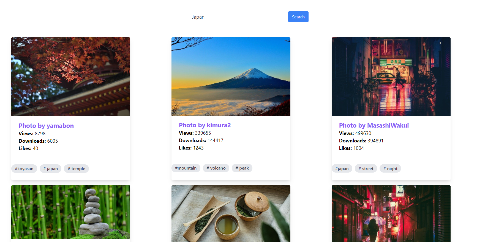
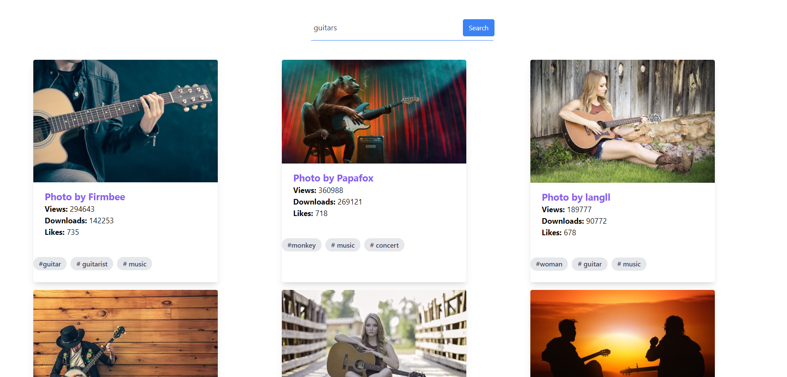

# React-Tailwind-Image-Gallery

React Tailwind Image Gallery

<!-- Live link to deployed app -->

Repository: https://github.com/Mdudzik92/React-Tailwind-Image-Gallery 
Deployed app: https://mdudzik92.github.io/JS-Tip-Calculator/

<!-- Technologies used -->

JavaScript, Tailwind CSS, React, React Hooks, API

<!-- Explanation of what the app is -->

This is an image gallery app built with React and Tailwind CSS which allows the user to type in a specific type of picture of any kind, and, through using the Pixabay API, have several different images be presented. The image data is also shown such as the number of views, likes, downloads, and a few tags per image relevant to the photo.

<!-- Screencastify -->

Screencastify link:
https://drive.google.com/file/d/1nDUYLPWKBJm5hEC-9sy1BLAAftCN7gSZ/view

<!-- Screenshot -->

<!-- License -->

MIT

<!-- Contact information -->

Email: mdudzik92@gmail.com
